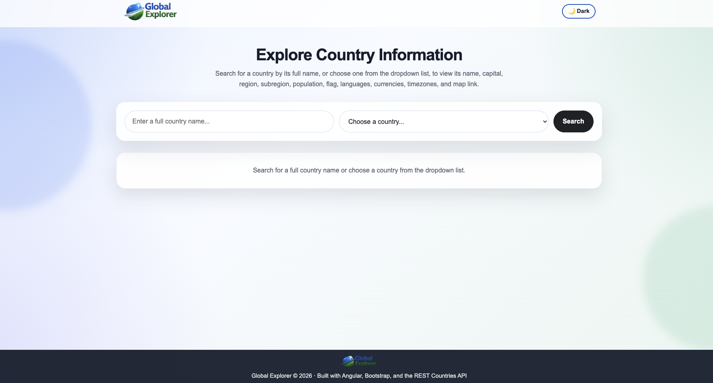
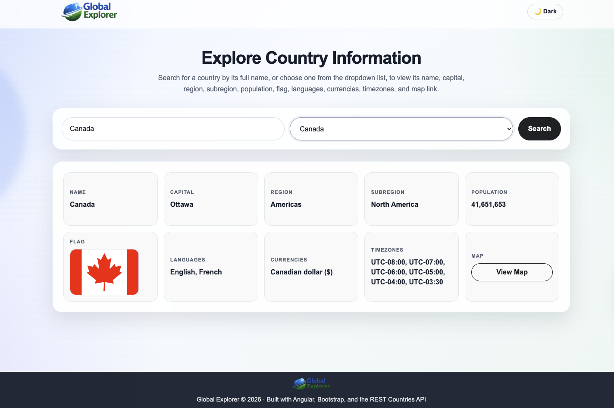
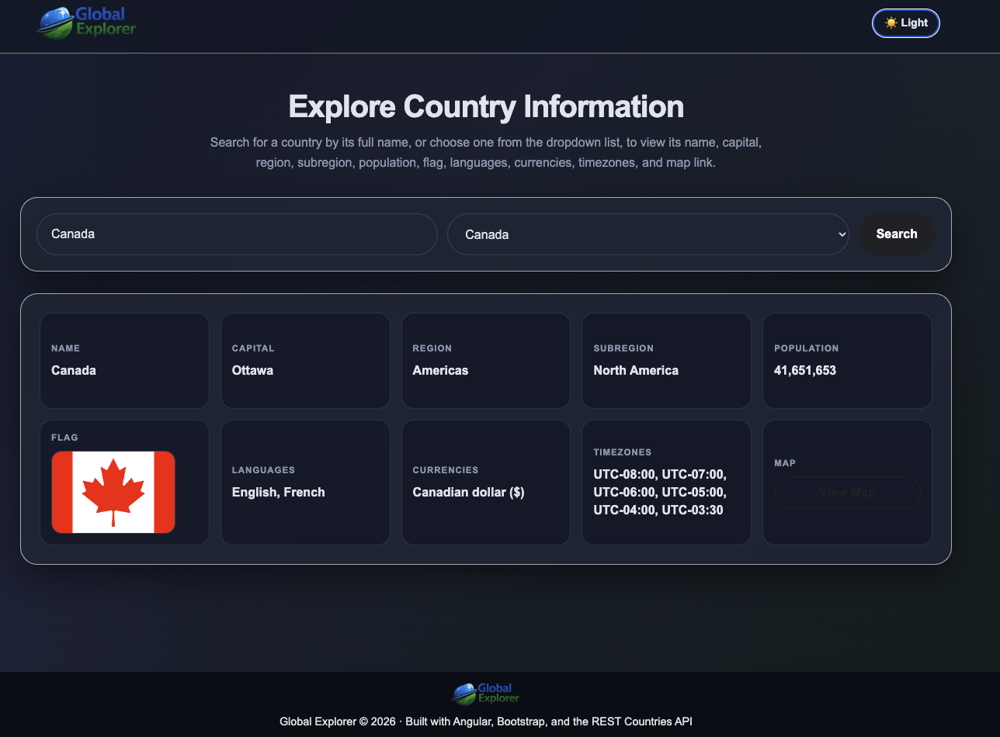
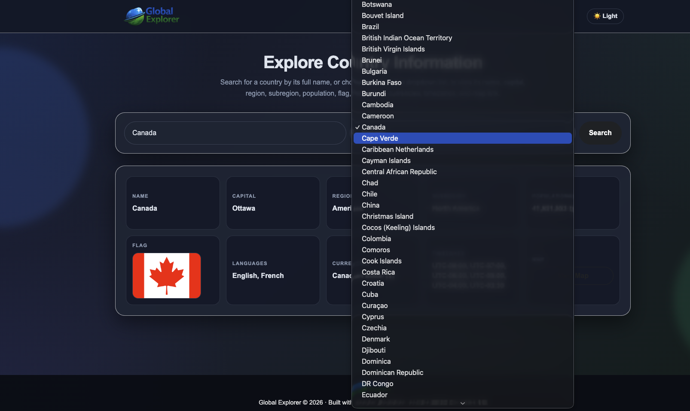

# Global Explorer

An Angular web application that allows users to search for detailed information about any country in the world using the [REST Countries API](https://restcountries.com/).

## Screenshots

**Light mode — empty state**


**Light mode — search result**


**Dark mode — search result**


**Dark mode — dropdown open**


## Features

- Search for any country by its full name
- Dropdown with all available country names
- Displays country details: flag, capital, region, subregion, population, languages, currencies, and timezones
- Dark mode support (persisted via localStorage)

## Tech Stack

- [Angular 21](https://angular.dev/)
- [REST Countries API v3.1](https://restcountries.com/)
- TypeScript
- CSS

## Getting Started

### Prerequisites

- Node.js >= 18
- npm >= 11

### Installation

```bash
npm install
```

### Run Development Server

```bash
npm start
```

Open your browser at `http://localhost:4200`.

### Build

```bash
npm run build
```

### Run Tests

```bash
npm test
```

## Project Structure

```
src/
├── app/
│   ├── components/
│   │   ├── country-card/     # Displays country details
│   │   ├── country-list/     # Renders a list of country cards
│   │   └── search-bar/       # Search input with dropdown
│   ├── models/
│   │   └── country.model.ts  # Country data interface
│   ├── pages/
│   │   └── home/             # Main page with search logic
│   └── services/
│       └── country.service.ts # API calls to REST Countries
└── styles.css                 # Global styles
```
